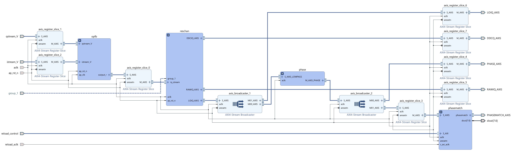
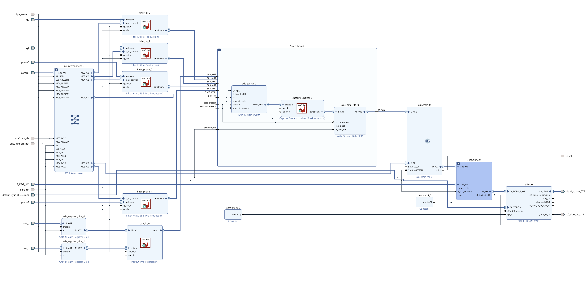

# MKID Gen3 Firmware Design

A Note: We suggest starting from [mkidgen3](https://github.com/MazinLab/MKIDGen3) if you are looking at this project for the first time. This repository is for the gateware and some associated test utilities. This document and project are in heavy flux and resource calculations are only partially done. Some linked projects do not yet exist or are untested (especially in the timekeeping/triggering area of the design) and the names and links are suggestive placeholders. In some cases there are alternative/backup approaches that are not described. The principal authors welcome and encourage email inquiry. 


***See `readme.md` for information on how to create a vivado project of the design and how to get started.***

The overall design is composed of a few subsystems:
- Plumbing: Control, Resets, Clocks, the RFDC, and the SoC interface
- Frequency Comb Generation
- Photon Pipeline: Raw data processing
- Capture: Raw and intermediate data capture


# Plumbing

### Clocks
1. 128 MHz clk_adc1. Used for control of axilite and generating 512 MHz clock. From ADC PLL.
2. 256 MHz clk_dac. Used for the dac_replay block. From the DAC PLL
3. 512 MHz pipeline clock. Generated by an MMCM in a clock wizard from the 128 MHz clock.
4. 256 MHz capture clock. Generated by an MMCM in a clock wizard from the 128 MHz clock.
5. 333 MHz DDR4 clock. Used to read/write from the PL DDR4. Generated by the MIG.

### Resets
Tied off for most of the design. The RFDC and the dac_replay blocks require them for proper functionality. The resets hierarchy contains all the processor resets and nearly all the constants used for resets in the design. 

### RF Data Converter Block
Two ADCs 
Detailed configuration of this block is TBD and handled from PYNQ. 

### Control

### SoC Interface


# Frequency Comb Generation
The comb is computed in python using repackaged code from gen2 on a per-feedline basis. The comb, as a 2x8x2^15 element LUT, is loaded as signed shorts into the [DAC 
Replay core](https://github.com/MazinLab/dac-replay-ip).

## DAC Replay Core
HLS (`#pragma HLS INTERFACE s_axilite port=return bundle=control`) with an AXI4 Master, three AXIS Masters, and a few axilite control params. Clocked directly from RFDC clk_dac1 output @ 256 MHZ. Uses 60 URAMS for up to 2MiB of replay buffer.

The core has two loops, the first fetches and fills the replay buffer. The second pipelined with an II=1, runs as long as the run bit is set, replaying the from the buffer with whatever settings the core was started with. 

AXI4M:
 - Issues 128b reads directly to PS DDR via S_AXI_HP0_FPD @ 256MHz

AXIS:
- I to DAC10 (256b)
- Q to DAC11 (256b)
- IQ words with TUSER and TLAST for debugging (512,8,1b)


# Photon Processing Pipeline
The readout subsystem is significantly more complicated than the comb generator. It consists of an oversampled polyphase filter bank (OPFB), followed by resonator channel selection, direct digital down conversion, low-pass filtering, iq->phase conversion, and optimal filtering. Even triggering, estimation,  and capture (both event and dbug) are considered different subsystems. Presently the design is roughly complete through the optimal filtering stage, though significant DSP testing remains. 



Within the `photon_pipe` hierarchy data flows from the ADCs as follows:
- opfb/
  1. [adc-to-opfb](https://github.com/MazinLab/adc-to-opfb)
  2. Xilinx FIR Compiler Cores 256 channel 2 parallel path mode (configured by [opfb-fir-config](https://github.com/MazinLab/opfb-fit-config))
  3. [opfb-fir-to-fft](https://github.com/MazinLab/opfb-fir-to-fft)
  4. Xilinx SSR (Vector) FFT, packaged and exported from ModelComposer (MazinLab_mkidgen3_ssrfft_16x4096_axis_v1_0)
  5. [pkg-fft-output](https://github.com/MazinLab/pkg-fft-output)
- reschan/
  1. [opfb-bin-to-res](https://github.com/MazinLab/opfb-bin-to-res)
  2. [resonator-dds](https://github.com/MazinLab/resonator-dds)
  3. Xilinx FIR Compiler in 256 channel 2 parallel path mode (static TDM lopass filter)
- phase/
  1. Xilinx Data width converter
  2. Xilinx Cordics
  3. [phase-user-attach](https://github.com/MazinLab/phase-user-attach)
- phasematch/
  1. Xilinx FIR Compiler Cores in 512 channel mode
  2. Coefficient reload subsystem comprising
    - AXI-Stream FIFO
    - AXI4S Data Width converter
    - AXI4S Clock Converter
    - AXI4S Switch
- trigger/
  1. [photon-trigger](https://github.com/MazinLab/photon-trigger)
  2. [photon-writer](https://github.com/MazinLab/XXXXX)
  3. [postage-stamp-monitor](https://github.com/MazinLab/XXXXX)
  4. Xilinx AXI4S clock converters,
  5. axis2mm cores
  6. Xilinx AXI4S data FIFO
  7. A Xilinx SmartConnect

AXI Interconnects, AXI4S broadcasters, combiners, and register slices are omitted here but scattered liberally throughout.


## Overlapped Polyphase Filter
The photon_pipe.opfb hierarchy ingests the raw data stream each ADC (one I, one Q) and yields an IQ stream of Overlapped Polyphase filter channels, each with 2 MHz of bandwidth.The OPFB runs at 512~Mhz, has no control lines, and has its reset tied off. Within in the hierarchy data flows through the HLS [adc-to-opfb](https://github.com/MazinLab/adc-to-opfb) block (dataflow, 2 functions, all ap_ctrl_none), then into the fir hierarchy where it is sliced/broadcast into bank of 16 FIR Compiler blocks configured by a small HLS coefficient select block ([opfb-fir-cfg](https://github.com/MazinLab/opfb-fir-cfg)) that runs once when the bitstream is loaded. 

The FIR outputs are merged with an axis combiner, fed through the [opfb-fir-to-fft](https://github.com/MazinLab/opfb-fir-to-fft) HLS block for processing (pipeline ii=1, flat, ap_ctrl_none), to an axis broadcast/slice, and into a super sample rate 4096 point FFT block exported from sysgen (16x256). The output of the FFT is packaged back into a single AXIS stream by [pkg-fft-output](https://github.com/MazinLab/pkg-fft-output) (pipeline ii=1, flat, ap_ctrl_none, ap_vld on the inputs). This last block generates the TLAST signal from an internal counter.

#### In:
- 256b AXI4S of 8 16b signed I words @ 512MHz
- 256b AXI4S of 8 16b signed Q words @ 512MHz
- reset
- clock, 512MHz, synchronous to the ADC I & Q datastreams

#### Out:
- 512b AXI4S of 16 32b signed IQ equipped with TUSER (16b, the 12b fft scale output) and TLAST every 256 transactions, any backpressure is ignored. 


#### Hierarchy:
- adc_to_opfb
- firs/
  - broadcast w/ slice
  - firs (w/ fft_config)
  - combiner
- fir_to_fft
- fft/
  - broadcast w/ slice
  - SSR FFT (4096 16x256)
  - pkg_fft_output

#### Utilization:
- for 8 taps: 256 (FIR) + 144 (FFT) DSP48
- for 4 taps: ~17% LUT (20% or LUTRAM) 6% FF, 0.7% BRAM, 3.5% DSPs


### adc-to-opfb
```cpp
void adc_to_opfb( hls::stream<ap_uint<128>> &istream, hls::stream<ap_uint<128>> &qstream, hls::stream<ap_axiu<512,0,0,0>> &lanes) {
#pragma HLS DATAFLOW
#pragma HLS INTERFACE axis register port=istream
#pragma HLS INTERFACE axis register port=qstream
#pragma HLS INTERFACE axis register port=lanes
#pragma HLS INTERFACE ap_ctrl_none port=return
// ...
```

#### In: 
- I Stream 128b AXI4S of 8 16b signed words
- Q Stream 128b AXI4S of 8 16b signed words

#### Out:
- Interleaved IQ Stream 512b AXI4S of 16 32b complex signed words, stream equipped with TLAST that asserts every 512 beats.

This block takes the incoming 8 I & Q samples and bundles them into uint256 groups of 8 complex words for internal operations. It breaks the 8 IQ into 16 by applying feeding the even and odd lanes with every other sample (i.e. sample 0, 16, 32 -> 
lane0; 8, 24, 40 -> lane1; sample 1, 17, 33 -> lane2; etc). Two delay lines 128 samples and uses the
delay line to drive the output in 'off' cycles, thereby resulting in output with sample indices like 0, -127, 1, -126, ... for a given lane. The resulting pattern may be seen in full, along with the intended FIR coefficient set (TODO) for
multiplication in the simulation output. TLAST is set on the 512th cycle. 

### FIR Compiler Bank
The interleaved IQ stream for *adc_to_opfb* is split into 16 single IQ streams via a broadcaster with each sent into one of 16 FIR Compiler cores. The broadcaster has TREADY disabled. 

The 16 FIRs are configured for 512 channel 2 parallel path 16 bit input, 16 bit output with 256 coefficient sets. Configuration is by channel and done by the [opfb-fir-cfg](https://github.com/MazinLab/opfb-fir-cfg) block sending coefficient set order as 0, 0, 1, 1, 2, 2, ... via a broadcaster. Coefficient reload is disabled. The FIRs are configured for vector framing with no TUSER input or output and no TREADY support. 

The output is remerged into a single stream via an axi4s combiner. 

### opfb-fir-to-fft
```cpp
void fir_to_fft(hls::stream<ap_axiu<512, 0,0,0>> &input, hls::stream<ap_axiu<512, 0,0,0>> &output) {
#pragma HLS PIPELINE II=1
#pragma HLS INTERFACE axis register port=input
#pragma HLS INTERFACE axis register port=output
#pragma HLS INTERFACE ap_ctrl_none port=return
// ...
```

#### In:
- Interleaved IQ Stream 512b AXI4S of 16 32b complex signed words, stream equipped with TLAST that asserts every 512 beats.
#### Out:
- Interleaved IQ Stream 512b AXI4S of 16 32b complex signed words, stream equipped with TLAST that asserts every 512 beats.

This block takes the merged IQ stream from the FIR bank and reorders them as needed to feed the FFT. The stream is broken into even (group A) and odd samples, with odd samples grouped into a group of the first 128 (group B) and second 128 (group C). Samples are stored in internal FIFOs and sent on in order from group A, then C, then B, thereby achieving the alternating cycle reorder required by the OPFB. The resulting index order from this are available from the C simulation of the core.


### Vector (SSR) FFT
#### In: 
- 16 IQ 32b AXI4S streams of complex signed words. Side channels are ignored. TREADY is permanently asserted. 
- 12b Scale Port

#### Out: 
- 16x 32b output ports of of complex signed words and an output valid line.
- 12b overflow port

The FFT is done by the Xilinx Vector FFT from the SSR Blockset for System Generator/Model Composer. The inputs into the FFT must be connected in an interleaved fashion to ensure the expected natural bin order. The first 8 inputs coming from the even lanes and the second 8 inputs from the odd lanes. This order is ensured by the preceeding blocks in the design. The HLS SSR FFT is not used as of HLx 2019.2 as there were both windows/linux compile issues and initial tests showed it may not make timing.


### pkg-fft-output 
```cpp
typedef unsigned int iq_t;

void pkg_fft_output(iq_t iq00, iq_t iq01, iq_t iq02, iq_t iq03, iq_t iq04, iq_t iq05, iq_t iq06, iq_t iq07, iq_t iq08, iq_t iq09, iq_t iq10, iq_t iq11, iq_t iq12, iq_t iq13, iq_t iq14, iq_t iq15, ap_uint<12> scale, hls::stream<ap_axiu<512,16,0,0>> &output) {
#pragma HLS INTERFACE ap_vld port=iq00
#pragma HLS INTERFACE ap_vld port=iq01
#pragma HLS INTERFACE ap_vld port=iq02
#pragma HLS INTERFACE ap_vld port=iq03
#pragma HLS INTERFACE ap_vld port=iq04
#pragma HLS INTERFACE ap_vld port=iq05
#pragma HLS INTERFACE ap_vld port=iq06
#pragma HLS INTERFACE ap_vld port=iq07
#pragma HLS INTERFACE ap_vld port=iq08
#pragma HLS INTERFACE ap_vld port=iq09
#pragma HLS INTERFACE ap_vld port=iq10
#pragma HLS INTERFACE ap_vld port=iq11
#pragma HLS INTERFACE ap_vld port=iq12
#pragma HLS INTERFACE ap_vld port=iq13
#pragma HLS INTERFACE ap_vld port=iq14
#pragma HLS INTERFACE ap_vld port=iq15
#pragma HLS INTERFACE ap_vld port=scale
#pragma HLS INTERFACE axis register forward port=output
#pragma HLS PIPELINE II=1
#pragma HLS INTERFACE ap_ctrl_none port=return
\\...
```

#### In: 
- 16x 32b ports of complex signed words and associated valid lines.
- 12b Scale overflow port

#### Out: 
- 512b AXI4S stream of 16 32b complex signed IQ words. TUSER contains the overflow status of the SSR FFT. TLAST is asserted every 256th beat, indicating the beat of the last OPFB bin in a full spectrum

This block ingests the SSR FFT output and packages it into a single wide axis stream.


## Resonator Channelization
The blocks here select 2048 IQ streams from the 4096 FFT IQ bins, digitally down-convert the IQs, and then lowpass and decimate (2:1) them. The selection is done by the [bin-to-res](https://github.com/MazinLab/bin-to-res) (pipelined II=1, ap_ctrl_none, flat, axilite port for resmap) and the DDC by the [resonator-ddc](https://github.com/MazinLab/resonator-dds) (git repo is a misnomer) block (ap_ctl_none, pipelined ii=1, pipelined subfunctions, axilite port for tone control).


Hierarchy: photon_pipe/reschan/
- bin_to_res
- broadcast to debug capture
- resonator_ddc
- broadcast to debug capture
- lowpass fir
- broadcast to debug capture


Inputs: 
- 512b AXI4S of 16 16b complex numbers, with TLAST
- AXI-Lite resonator map port
- AXI-Lite resonator tone port

Outputs:
- 256b AXI4S of 8 16b complex, with TLAST, TUSER (group), valid every other clock (256MHz data @ 512MHz)
- AXI4S debug streams for capturing raw ADC IQ and DDCd IQs

Utilization: TODO


#### opfb-bin-to-res Selection
Inputs: 
- 2 288bit AXI4S of 16 18 bit numbers (I and Q streams), both equipped with TLAST
- AXI-Lite resonator map port (256x8 ap_uint<12> array).

Outputs:
- 1 288bit AXI4S of 8 18 bit complex equipped with TLAST and possibly (TODO) TKEEP

The resonator selection [HLS block](https://github.com/MazinLab/opfb-bin-to-res) ingests the IQ bins output by the
OPFB subsystem and extracts and outputs the IQ values corresponding to resonators. This is done by caching the bin
spectrum (updating the next 16 bins each clock) and fetching 8 bins containing resonators each clock. This is
implemented as 8 banks of ~147kbit BRAM in order to have sufficient memory ports. The bins used are stored in a bin
to resonator LUT (2048 x 12 bits) loaded in from python via AXI Lite. 

####  resonator-dds
Inputs: 
- 1 288bit AXI4S of 8 18 bit complex equipped with TLAST and possibly (TODO) TKEEP or TUSER
- Quarter wave SIN/COS LUT of length... This is implemented in ROM and sized to support 8 simultaneous reads.
- Resonator frequency table stored as a phase increment LUT.
- Resonator phase shift table stored as a phase zero.

Outputs:
- 1 288bit AXI4S of 8 18 bit complex equipped with TLAST and possibly (TODO) TKEEP

Utilization:
- 24 DSP48

The HLS block uses the TLAST on the inbound stream to keep track of the cycle and query phase and phase increment
LUTs for the received group of resonators. These are used increment/maintain an accumulated phase for each resonator
which is used to query a quarter-wave sin/cos LUT (stored in ROM). Phase offsets are used to apply a per-resonator 
phase shift (rotate loops in gen2 parlance). Presently the result is neither dithered nor Taylor corrected, however
there is example Xilinx HLS code for how to implement those features as well. The resulting sin/cos values are fed 
into a Xilinx complex multiplier (3 DSP slices per IQ, 24 in total) and the results passed out of the block.

#### FIR Core
Utilization:
- 320 (or 240) 

The fir is configured for 256 channel, 16 parallel channel (8I, 8Q) operation with 20 taps and 18 bit IO. It is
configured for a decimation of 2, dropping the sample rate to 1 MHZ. This takes ~320 DSP slices, though the core
itself should be able to run at ~820MHz, so with a clock crossing we could run with 8 to 6 to 8 lanes for a total of
240 DSP slices.


##### FIR block and HLS channel config
- 200 DSP slices, 138 if FIR at 768MHz (assuming 50/51 taps)

The FIR is configured for 256 channel operation with 51 taps for 256 reloadable coefficient sets and 18 bit IO
It is configured to operate at 768 MHz and for by channel coefficient operation. This takes 17 DSP slices. The
channel configuration is streamed in 0,1,2,3... from a simple VHDL block. The reload channel is an input to the
subsystem. TUSER is passed through.

## Phase

## Phasematch

## Trigger

# Capture
Debugging and setup of the MKID readout requires capturing raw data from various points in the processing pipeline. AXI4S broadcasters are used in various hierarchies to tap into and route data streams to the capture subsystem, key cores are  `pair_iq` (for raw ADC capture), `filter_iq` (for capturing IQ samples), or `filter_phase` (for capturing phase samples) (all [here](https://github.com/MazinLab/iq-capture)). A stream switch is used to pick between streams and feed one to Dan Gisselquist's lovely `axis2mm` (`./blocks/wb2axip/axis2mm.v`) verilog core to generate the AXI write transactions to PL DDR4. The subsystem uses the [capture_upsizer](https://github.com/MazinLab/captur-upsizer) HLS block to upsize from a 256b to 512b AXI4S stream after the switch. A customized version of Xilinx's AXI4S Interconnect ("JebConnect") is used to ensure that there is sufficient buffering to handle MIG auto-refresh cycles. The resulting capture system is capable of capturing at a sustained 16.384 GiB/s. 


